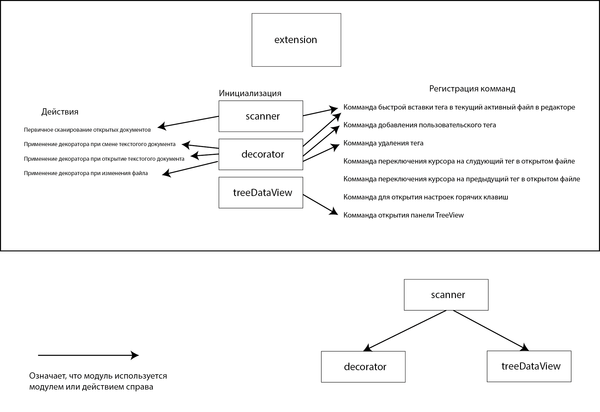

# Tag-Highlighter
## Общее описание
Плагин **Tag-Highlighter** подсвечивает встроенные (`TODO`, `FIXME`, `NOTE`) и пользовательские теги в коментариях кода в IDE Vs Code. Позволяет производить быструю навигацию по тегам и отслеживаение их наличие в файлах открытой директории в Vs Code в боковой панели 
## Функциональность
+ Подсветка тегов

+ Создание пользовательских тегов с возможностью указать пользовательский цвет


+ Удаление тегов
+ Открытие боковой панели просмотра тегов в файлах, открытых в IDE.

+ Навигация между тегами в открытом файле
+ Быстрая вставка комментария с тегом
## Команды
+ `Tag Highlighter: Открыть список тегов`
+ `Tag Highlighter: Следующий тег` — Передвинуть курсор на тег, следующий после текущей позиции курсора (сочетание клавиш: **ctrl+alt+o**)
+ `Tag Highlighter: Предыдущий тег` — Передвинуть курсор на тег, находящийся выше текущей позиции курсора (сочетание клавиш: **ctrl+alt+p**)
+ `Tag Highlighter: Открыть настройки горячих клавиш`
+ `Tag Highlighter: Добавить тег`
+ `Tag Highlighter: удалить тег`
+ `Tag Highlighter: быстрая вставка тега` — Вставляет комментарий с тегом на позицию, на которой находится курсор. (сочетание клавиш **ctrl+alt+i**)
## Модули и функции кода
### [Модуль Decorator](/src/decorator.ts)
**Модуль отвечающий за визуальную декорацию фрагмента текстового файла.**
    
Актуализирует в классе *Decorator* цвета тегов из конфига в workspace IDE
```
reloadColors() 
```
Принимает текстовый документ и массив тегов в этом файле.
Применяет декоратор ко всем тегам в этом файле
```
decorateEditor(vscode.TextEditor, TodoItem[])
```
Принимает название тега и создает `TextEditorDecorationTypeяя(если не существует) с параметрами из конфигурации тега в workspacce
Возвращает созданный или найденный `TextEditorDecorationType`
```
private getOrCreate(string): vscode.TextEditorDecorationType
```
Удаляет декораторы
```
dispose()
```
### [Модуль Scanner](/src/scanner.ts)
**Модуль отвечающий за сканирование документов на наличие тегов с помощью регулярных выражений**  

Функция отчистки класса
```
dispose()
```
Принимает массив тегов
Инициализирует массив тегов класса и массив регулярных выражений с помощью аргумента
```
setTags(TagConfig[])
```
Принимает объект типа `vscode.TextDocument` и производит в нём сканирование на наличие тегов,
инициализированных в классе. Кеширует `URI` файла в классе.
Возвращает массив найденных тегов и их координаты в файле.
```
async scanDocument(vscode.TextDocument): Promise<TodoItem[]>
```
Принимает выражение сканируемых объектов и деректорий; и исключаемых объектов и директорий
Сканирует workspace IDE на наличие тегов
```
async scanWorkspace(glob = '**/*.*', exclude = '**/node_modules/**'): Promise<TodoItem[]>
```
Принимает `URI` файла.
Возвращает массив тегов в этом файле
```
getTodosForUri(vscode.Uri): TodoItem[]
```
Возвращает массив тэгов с закешированными `URI`
```
getAllCached(): TodoItem[]
```
Принимает `URI`.
Удаляет закешированный `URI`
```
clearCache(vscode.Uri)
```
Принимает строку с регулярным выражением и отчищает её от регулярного выражения.
```
escapeRegex(string)
```
### [Модуль TreeDataView](src/treeDataView.ts)
**Модуль отвечающий за работу TreeView тегов**

Удаление окна TreeView
```
dispose()
```
Обнавляет окно TreeView
```
refresh()
```
Принимает аргумент класса `TodoNode` и возвращает `TreeItem`
```
getTreeItem(TodoNode): vscode.TreeItem 
```
Принимает класс `TodoNode` и возвращает его массив его потомков
```
async getChildren(TodoNode): Promise<TodoNode[]>
```
### [extension](/src/extension.ts)
**Точка входа (функция activate)**  
#### Регистрация комманд
+ Комманда открытия панели TreeView
+ Комманда быcтрой вставки тега в текущий активный файл в редакторе
+ Комманда добавления пользовательского тега
+ Комманда удаления тега
+ Комманда переключения курсора на слудующий тег в открытом файле
+ Комманда переключения курсора на предыдущий тег в открытом файле
+ Комманда для открытия настроек горячих клавиш
#### Функции
Возвращает массив тегов из конфигурации плагина в workspace IDE.
```
getConfigTags(): any[]
```
Принимает массив тегов и сохраняет их в конфигурацию плагина в workspace.
```
saveConfigTags(tags: any[])
```
Принимает строку пользовательского ввода и преобразует её в корректную кодировку цвета RGB в шестнадцатеричной записи 
```
normalizeHexColor(string | undefined): string | undefined
```
Находит ближайший тег (выше или ниже в зависимости от аргумента. 1 и -1 соответственно) в открытом файле относительно курсора
Перемещает курсор на найденный тег
Принимает направление поиска и класс `Scanner`
```
navigateTag(1 | -1, Scanner)
```
#### Действия во время исполнения
+ Первичное сканирование открытых документов
+ Применение декоратора при смене текстогого документа
+ Применение декоратора при открытие текстогого документа 
+ Применение декоратора при изменения файла
### Диаграмма взаимодействия модулей
